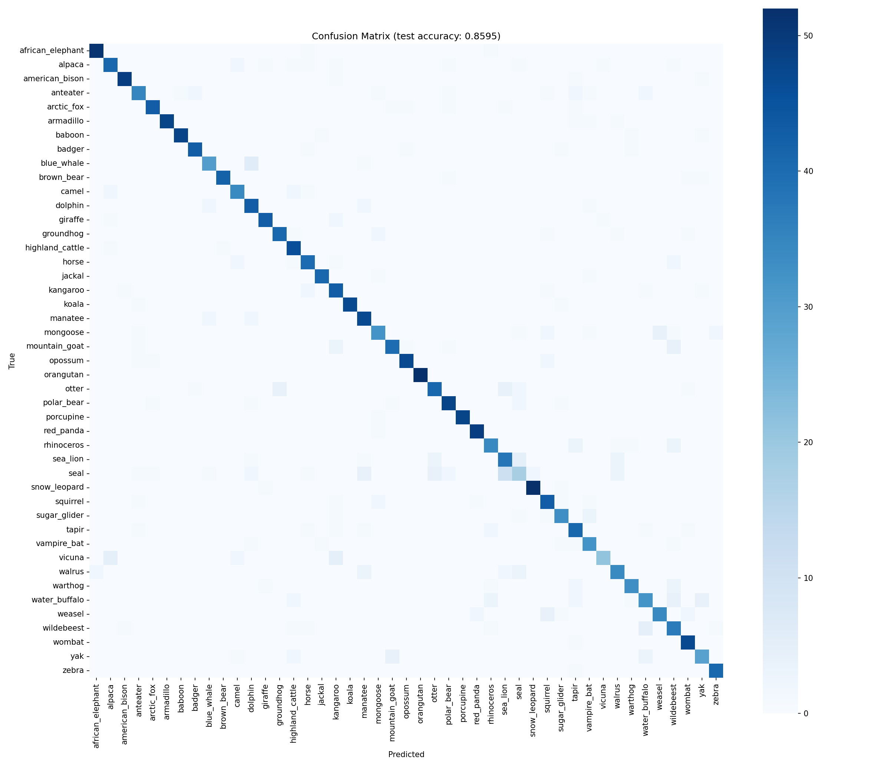
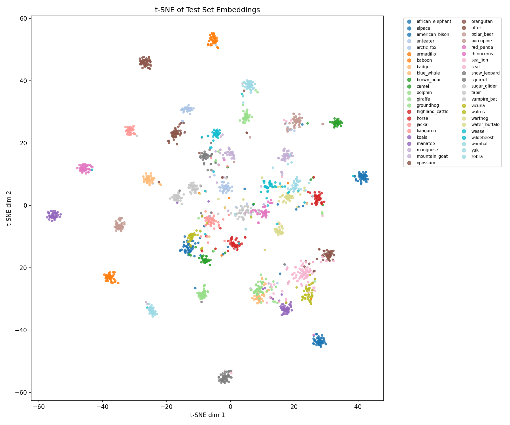

# 🐾 Animal Species Classifier — Siamese Network, Two-Stage Training

A lightweight image classifier for 45 animal species, built around a
Siamese-style metric-learning encoder and a small classifier head trained
on top of it. Designed to train on a single consumer GPU (developed and
tested on 8GB VRAM / 16GB RAM / Ryzen 7).

Live Demo : https://mammalclassification-89wnvzsartehsserceymc3.streamlit.app/
## How it works

Instead of training a single network to go straight from image → class
label, the pipeline splits the problem into two stages:

**Stage 1 — Encoder (metric learning).**
An `EmbeddingNet` (a pretrained backbone + a small projection head) is
trained with **batch-hard triplet loss** so that images of the *same*
class end up close together in embedding space, and images of
*different* classes end up far apart. No class labels are predicted
here — the network only learns a good geometric arrangement of
embeddings. `PKSampler` builds each batch from P classes × K images so
the loss always has same-class pairs to mine hardest positives from.

**Stage 2 — Classifier.**
The encoder is frozen, embeddings are pre-computed once for the whole
train/val set, and a small MLP head is trained on those fixed vectors to
predict the actual class. Because Stage 1 already did the hard work of
separating the classes geometrically, this head is deliberately tiny and
trains fast.

**Evaluation** runs both stages on the held-out test set and produces
a confusion matrix, a t-SNE plot of the embedding space, a full
per-class classification report, and a `metrics.json` summary.

## Results

Backbone: **ResNet18** (ImageNet-pretrained, via `timm`)
Image size: **190×190**
Stage 1 (encoder) epochs: **10** · Stage 2 (classifier) epochs: **10**

| Metric | Value |
|---|---|
| Test accuracy | **85.95%** |
| Macro avg F1 | 0.856 |
| Weighted avg F1 | 0.858 |
| Test set size | 2,107 images (45 classes) |

**Confusion matrix**



**t-SNE of test-set embeddings** — each cluster is one class; tight,
well-separated clusters mean the Stage 1 encoder learned a genuinely
useful embedding space, independent of the Stage 2 classifier's own
accuracy.



**Best-performing classes** (F1 ≥ 0.95): `orangutan` (1.00),
`koala` (0.98), `porcupine` (0.99), `armadillo` (0.97),
`african_elephant`, `american_bison`, `snow_leopard` (0.95–0.96) —
mostly animals with a fairly distinctive silhouette or texture.

**Weakest classes:** `seal` (precision 0.55 / recall 0.36 / F1 0.43) is
by far the hardest class, almost entirely confused with `sea_lion` —
visually very similar marine mammals with limited distinguishing detail
at this resolution. `vicuna` (recall 0.64) is regularly confused with
`alpaca`, and the horned/bovine cluster — `water_buffalo`, `yak`,
`wildebeest`, `american_bison`, `highland_cattle` — shows the next-most
overlap, which is visible as the faint off-diagonal smudges around that
block in the confusion matrix. `mongoose` also underperforms (F1 0.76),
without an obvious single look-alike class.

Full per-class numbers are in
[`results/classification_report.txt`](results/classification_report.txt)
and [`results/metrics.json`](results/metrics.json).

### Note on the from-scratch backbone

`config.py` also supports `BACKBONE_NAME = "tinyresnet"`, a small
from-scratch CNN (see `models/backbone.py`) that avoids any pretrained
weights entirely. In practice it did not train usefully in this setup —
it landed around 2.5% test accuracy, which is roughly chance-level for
45 classes. It was not used for the results above. This is most likely
a symptom of too few epochs / too little data for a randomly-initialized
CNN rather than a fundamental flaw in the architecture — training it
properly would likely need many more epochs, stronger augmentation, or
both. Left in the codebase as a documented option rather than removed.

The other pretrained options (`mobilenetv3`, `mobilevit_xs`,
`efficientnet_lite0`) are wired up via the same `get_backbone()` factory
but haven't been benchmarked yet — swapping `BACKBONE_NAME` in
`config.py` is all that's needed to try one.

## Project structure

```
animal-siamese-classifier/
├── README.md
├── requirements.txt
├── .gitignore
├── config.py                 # single source of truth for all paths/hyperparameters
├── main.py                   # entry point: splits -> encoder -> classifier -> evaluate
├── app.py                    # Streamlit demo (upload an image, get top-5 predictions)
│
├── data/
│   ├── raw/                  # data/raw/<class_name>/*.jpg (gitignored, not committed)
│   └── splits.py             # builds stratified train/val/test CSVs + class_names.json
│
├── models/
│   ├── backbone.py           # TinyResNet (from scratch) + timm pretrained backbones + factory
│   ├── embedding_net.py       # backbone -> projection head -> L2-normalized embedding
│   └── classifier.py         # small MLP head over frozen embeddings
│
├── losses.py                 # batch-hard triplet loss
├── dataset.py                 # ImageDataset + PKSampler
├── train_encoder.py           # Stage 1 training
├── train_classifier.py        # Stage 2 training
├── evaluate.py                 # test-set metrics, confusion matrix, t-SNE
│
├── checkpoints/               # encoder.pt, classifier.pt (gitignored -- see below)
├── results/                    # metrics.json, plots, classification report
└── notebooks/
    └── explore.ipynb
```

## Setup

```bash
git clone <your-repo-url>
cd animal-siamese-classifier

python -m venv venv
source venv/bin/activate      # Windows: venv\Scripts\activate

pip install -r requirements.txt
```

Then add your data:

```
data/raw/<class_name>/*.jpg
```

with one folder per class, matching the 45 class names below.

## Usage

Run the whole pipeline end to end:

```bash
python main.py
```

This builds the train/val/test splits (skipped automatically if they
already exist — pass `force=True` to `data/splits.py`'s `main()` to
rebuild), trains the encoder, trains the classifier, evaluates on the
test set, and writes everything to `results/`.

Or run each stage on its own — useful for debugging or resuming after a
crash:

```bash
python data/splits.py        # build splits + class_names.json
python train_encoder.py      # Stage 1: metric learning
python train_classifier.py   # Stage 2: classifier head (loads checkpoints/encoder.pt)
python evaluate.py           # test-set evaluation (loads both checkpoints)
```

Every hyperparameter and path lives in `config.py` — backbone choice,
image size, batch composition (`P_CLASSES` / `K_IMAGES`), learning
rates, epoch counts, etc. Nothing else in the codebase hardcodes these
values.

## Demo app

A Streamlit app (`app.py`) loads the trained checkpoints and lets you
upload a photo to see the model's top-5 predictions with confidence
scores:

```bash
streamlit run app.py
```

## Classes (45)

```
african_elephant, alpaca, american_bison, anteater, arctic_fox, armadillo,
baboon, badger, blue_whale, brown_bear, camel, dolphin, giraffe, groundhog,
highland_cattle, horse, jackal, kangaroo, koala, manatee, mongoose,
mountain_goat, opossum, orangutan, otter, polar_bear, porcupine, red_panda,
rhinoceros, sea_lion, seal, snow_leopard, squirrel, sugar_glider, tapir,
vampire_bat, vicuna, walrus, warthog, water_buffalo, weasel, wildebeest,
wombat, yak, zebra
```


## Hardware used

Trained on a single consumer GPU with 8GB VRAM, 16GB system RAM, and a
Ryzen 7 CPU. Mixed precision (`config.USE_AMP = True`) is what makes a
ResNet18 backbone at 190px comfortably fit in that budget.
